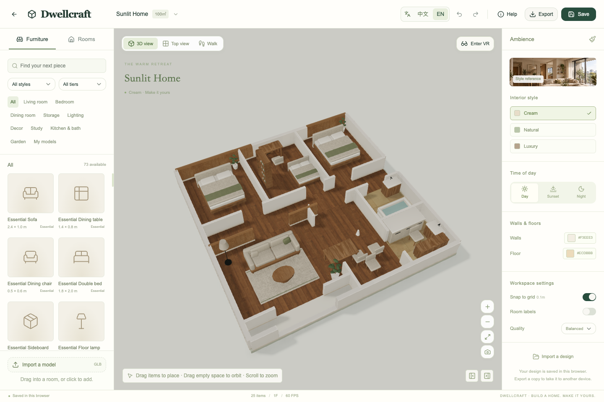
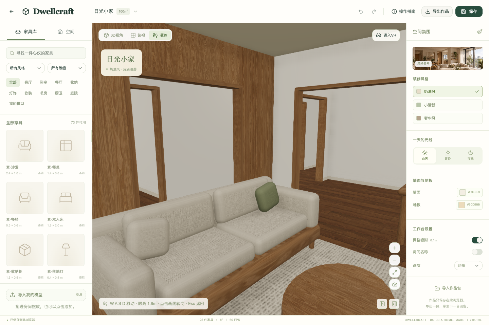
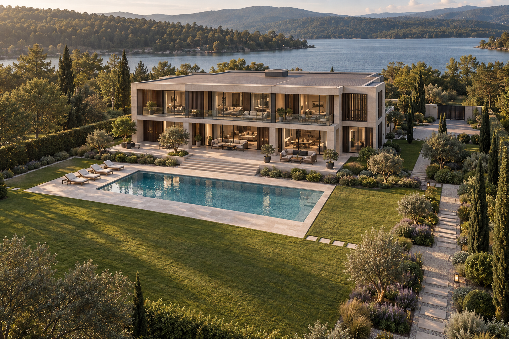

# Dwellcraft · 住进想象

**在浏览器里装修自己的家，走进你设计的生活。**

**Design your home in the browser. Step inside the space you create.**

[中文说明](#中文) · [English](#english) · [效果图 / Gallery](#gallery)

3D 家装游戏原型 · Browser-based 3D home design game prototype

**v0.1.0** · React · TypeScript · Babylon.js · WebXR

<a id="gallery"></a>

## 效果图 / Gallery

### 实际游戏画面 / In-game screenshots

以下为开发版本的浏览器实拍，展示装修工作台与第一人称漫游。

These screenshots were captured from the running development version, showing the editor and first-person walkthrough.

**装修工作台（英文界面） / Editor (English interface)**



<details>
<summary>查看第一人称漫游 / View the first-person walkthrough</summary>

**第一人称漫游（中文界面） / First-person walkthrough (Chinese interface)**



</details>

<details>
<summary>查看三个场景的概念效果图 / View concept renders for all three homes</summary>

以下图片为设计阶段的概念参考，**不是实时游戏截图**。当前版本的模型精细度、间接光和窗外景观仍在完善中。

These are design concepts, **not real-time game screenshots**. Model detail, indirect lighting and exterior scenery are still being developed.

**100㎡ 日光小家 · 三室两厅 · 奶油风 / 100 m² Sunlit Home · 3 bedrooms, living & dining · Cream**


**200㎡ 林景大平层 · 四室两厅 · 小清新 / 200 m² Forest Residence · 4 bedrooms, living & dining · Natural**


**4000㎡ 湖畔庄园 · 两层别墅 · 奢华风 / 4,000 m² Lakeside Estate · Two-storey villa · Luxury**

4000㎡为庄园总占地；别墅两层各500㎡。

4,000 m² is the total site area; the villa has two floors of 500 m² each.



</details>

## 中文

Dwellcraft 是一个可在浏览器里运行的 **3D 家装游戏原型**。选择住宅、布置家具、调整材质和光照，再用第一人称视角走进自己的设计。当前版本包含装修工作台、本机存档、模型导入和中英文切换。

### 当前功能

- **三个住宅**：100㎡三室两厅、200㎡四室两厅、4000㎡庄园。庄园面积为总占地，别墅两层各500㎡。
- **72款内置家具**：54款由3种风格 × 3个等级 × 6类家具组成，另有18款配套物件。风格包括奶油风、小清新、奢华风。
- **自由摆放**：从家具库直接拖入3D或俯视布局，支持移动、旋转、复制、删除、属性调整、0.1m吸附、碰撞检查和50步撤销/重做。
- **多种视角**：3D环绕、俯视、1.6m眼高第一人称漫游、房间聚焦和别墅楼层切换。
- **材质与光照**：木饰面、布艺、石材、窗帘、室内补光、接触阴影，以及墙面/地板颜色和白天/黄昏/夜晚设置。
- **本机保存**：每户型1个作品槽，共3个；支持3秒延迟自动保存、手动保存和包含自定义模型的 `.home.zip` 导入/导出。
- **模型导入**：自包含GLB文件，支持尺寸识别、实际宽度设置和模型库。单文件≤50MB、≤20万三角面、贴图≤4096 × 4096，不加载外部引用；暂不支持Draco/Meshopt压缩和动画编辑。
- **中英文**：顶部 **中文 / EN** 即时切换，记住语言选择；家具搜索同时支持中英文，自定义模型名称保留原文。切换不会重置家具、选中状态、视角或撤销记录。
- **VR**：已接入WebXR入口、传送和基础家具操作，菜单支持中英文。**尚未完成Quest真机验收。**

### 本地启动

需要 **Node.js 22.13或更高版本**。

```sh
git clone https://github.com/Ryan-fm/Dwellcraft.git
cd Dwellcraft
npm ci
npm run dev
```

打开终端显示的本机网址。默认端口3000被占用时会自动换端口。

```sh
npm test           # 户型、碰撞、GLB校验、漫游眼高与双语测试
npm run typecheck  # TypeScript类型检查
npm run lint       # 项目代码检查
npm run build      # 正式构建
npm start          # 本地运行构建后的Worker
```

### 部署到 Vercel

在 Vercel 导入此 GitHub 仓库，项目根目录保持默认。仓库中的 `vercel.json` 已设置安装命令 `npm ci`、构建命令 `npm run build:vercel` 和输出目录 `dist/client`；Framework Preset 使用 **Other**，Node.js 使用 **24.x**。

也可在完成 Vercel CLI 登录后运行 `npx vercel --prod`。该构建生成静态页面和浏览器资源，不需要 Cloudflare Worker。线上作品仍保存在访问者的浏览器中。

### 操作指南

| 操作 | 使用方式 |
| --- | --- |
| 添加家具 | 从家具库拖进3D/俯视布局，绿色可放、红色表示冲突；也可点击添加 |
| 移动家具 | 拖动已放置家具 |
| 调整视角 | 拖动空白处旋转，滚轮缩放 |
| 旋转 / 复制 / 删除 | `R` / `⌘或Ctrl + D` / `Delete` |
| 撤销 / 重做 | `⌘或Ctrl + Z` / `⌘或Ctrl + Shift + Z` |
| 第一人称漫游 | 选择“漫游”，`WASD`沿地面移动，点击画面后用鼠标转向 |
| 退出漫游 | `Esc`返回3D视角 |
| 更换设备 | 导出作品包，在另一台设备导入 |

### 当前边界

当前以桌面浏览器为主。作品和用户模型仅保存在当前浏览器，无登录、云同步或用户模型云端上传。换设备或清理浏览器数据前，请导出作品包。

大部分家具采用程序化简化模型，包含1款扫描沙发。实时画面与概念效果图仍有差距；精细资产、完整外部景观、可编辑隔墙/门洞、手机完整装修操作及VR真机体验列入后续计划。

## English

Dwellcraft is a **browser-based 3D home design game prototype**. Choose a home, arrange furniture, adjust materials and lighting, then walk through your design at eye level. The current version includes a furnishing workspace, local saves, model imports and a Chinese/English interface.

### Current features

- **Three homes**: a 100 m² home with three bedrooms, a 200 m² residence with four bedrooms, and a 4,000 m² estate. Both apartments include living and dining rooms. The estate area refers to the whole site; its villa has two floors of 500 m² each.
- **72 built-in furniture items**: 54 items across 3 styles × 3 tiers × 6 furniture types, plus 18 accessories and supporting pieces. Styles: Cream, Natural and Luxury.
- **Furniture placement**: drag directly from the library into the 3D or top view. Move, rotate, duplicate, delete and edit properties, with 0.1 m snapping, collision checks and 50 steps of undo/redo.
- **Multiple views**: 3D orbit, top view, first-person walking at a 1.6 m eye height, room focus and villa floor switching.
- **Materials and lighting**: wood finishes, fabric, stone, curtains, interior fill lighting and contact shadows. Change wall/floor colours and choose day, sunset or night.
- **Local saves**: one design slot per home, three in total. Includes autosave after a 3-second delay, manual saves and `.home.zip` import/export with the custom models used in the design.
- **Model imports**: self-contained GLB files with dimension detection, real-world width settings and a personal model library. Maximum 50MB per file, 200,000 triangles and 4096 × 4096 per texture. External resources, Draco/Meshopt compression and animation editing are not currently supported.
- **Chinese and English**: switch instantly using **中文 / EN** at the top. Your choice is remembered. Furniture search accepts either language, while custom model names stay unchanged. Switching preserves your layout, selection, view and undo history.
- **VR**: WebXR entry, teleportation and basic furniture controls are implemented, with bilingual menus. **Testing on a physical Quest headset is still pending.**

### Run locally

Requires **Node.js 22.13 or newer**.

```sh
git clone https://github.com/Ryan-fm/Dwellcraft.git
cd Dwellcraft
npm ci
npm run dev
```

Open the local URL printed in the terminal. If the default port 3000 is busy, the development server selects another port.

```sh
npm test           # Layout, collision, GLB, walk-height and language tests
npm run typecheck  # TypeScript checks
npm run lint       # Project lint checks
npm run build      # Production build
npm start          # Run the built Worker locally
```

### Deploy to Vercel

Import this GitHub repository into Vercel using the default project root. The included `vercel.json` sets `npm ci` as the install command, `npm run build:vercel` as the build command and `dist/client` as the output directory. Select **Other** as the Framework Preset and **24.x** as the Node.js version.

Alternatively, sign in with the Vercel CLI and run `npx vercel --prod`. This build exports static pages and browser assets without a Cloudflare Worker. Designs remain stored locally in each visitor’s browser.

### Controls

| Action | Control |
| --- | --- |
| Add furniture | Drag a library card into the 3D/top view. Green means it fits; red means blocked. Clicking also adds an item. |
| Move furniture | Drag a placed item |
| Orbit / zoom | Drag empty space / scroll |
| Rotate / duplicate / delete | `R` / `⌘ or Ctrl + D` / `Delete` |
| Undo / redo | `⌘ or Ctrl + Z` / `⌘ or Ctrl + Shift + Z` |
| Walk inside | Choose **Walk**, use `WASD` to move along the floor, then click the view to look around with the mouse |
| Leave walk mode | Press `Esc` to return to the 3D view |
| Move to another device | Export your design package and import it on the other device |

### Current limitations

The editor currently targets desktop browsers. Designs and imported models are stored only in the current browser. There are no accounts, cloud sync or cloud uploads of user models. Export a design package before changing devices or clearing browser data.

Most furniture uses simplified procedural geometry, with one scanned sofa included. Real-time visuals still differ from the concept renders. More detailed assets, complete exterior scenery, editable walls/doorways, full mobile editing and physical VR validation remain on the roadmap.

## 项目结构 / Project structure

| 路径 / Path | 用途 / Purpose |
| --- | --- |
| `app/` | 选房、布局与样式 / Home selection, layout and styles |
| `components/studio.tsx` | 装修工作台与编辑状态 / Editor workspace and state |
| `components/language.tsx` | 语言切换与偏好 / Language controls and preferences |
| `lib/i18n.ts`, `lib/en.json` | 翻译与双语搜索 / Translations and bilingual search |
| `lib/world.ts` | 场景和家具数据 / Home and furniture data |
| `lib/scene-design.json` | 户型与门洞设计 / Floor plans and door openings |
| `lib/engine.ts`, `lib/furniture.ts` | 3D场景、材质、家具与XR / 3D scenes, materials, furniture and XR |
| `lib/navigation.ts`, `lib/placement.ts` | 漫游和摆放碰撞 / Walking and placement collision |
| `lib/storage.ts` | 本机存档、GLB校验与作品包 / Local saves, GLB validation and design packages |
| `public/assets/` | 模型、材质和环境光 / Models, textures and environment lighting |
| `docs/scene-design/` | 场景设计、完整计划和审查 / Scene designs, full plan and reviews |
| `docs/screenshots/` | 实际游戏截图 / In-game screenshots |
| `tests/` | 自动化测试 / Automated tests |

## 计划与资源 / Plans and credits

技术栈 / Stack: **React + TypeScript + Babylon.js + IndexedDB**, built with **Sites / vinext**.

- [完整开发计划 / Full development plan](docs/scene-design/development-plan.md)（中文 / Chinese）
- [实际进度与验证记录 / Implementation status and validation](docs/DEVELOPMENT.md)（中文 / Chinese）
- [资源来源与许可 / Asset sources and licences](docs/ASSETS.md)

纹理与扫描模型来自 **Poly Haven（CC0）**；概念图为设计阶段生成的参考图。图标来自 **Lucide（ISC）**，UI组件使用 **shadcn / Base UI**，分别遵循其开源许可。

Textures and the scanned sofa are from **Poly Haven (CC0)**. Concept renders were generated as design references. Icons are from **Lucide (ISC)**; UI components use **shadcn / Base UI** under their respective open-source licences.
