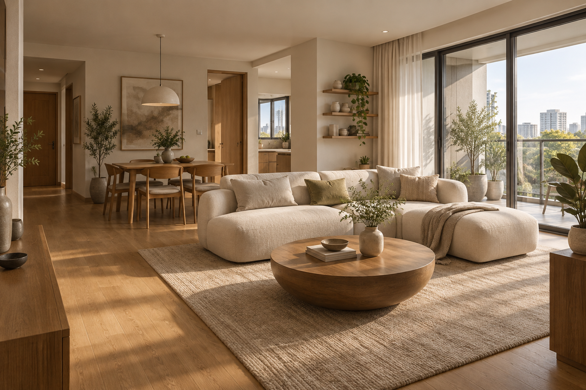
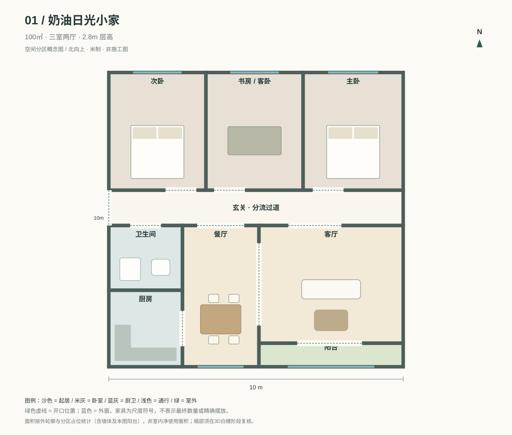
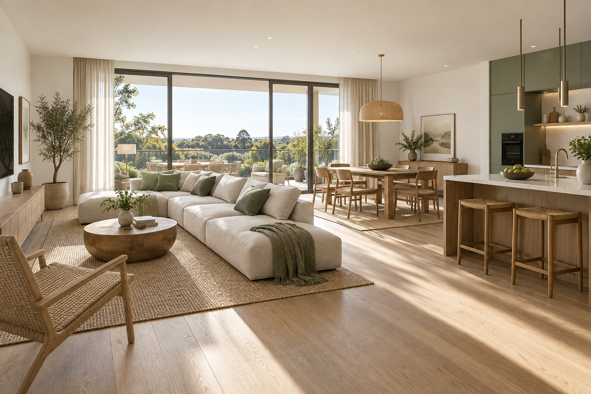
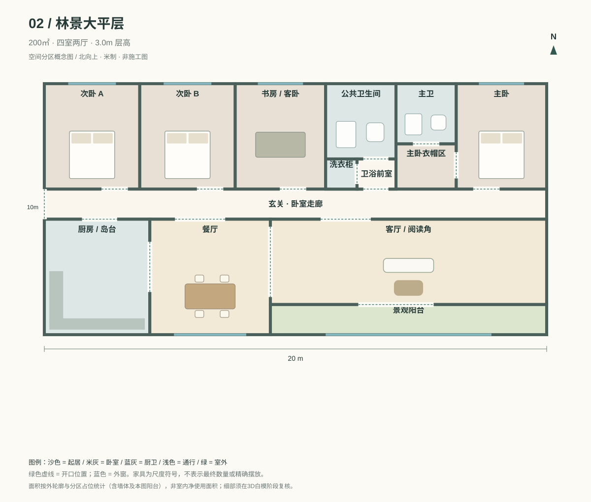
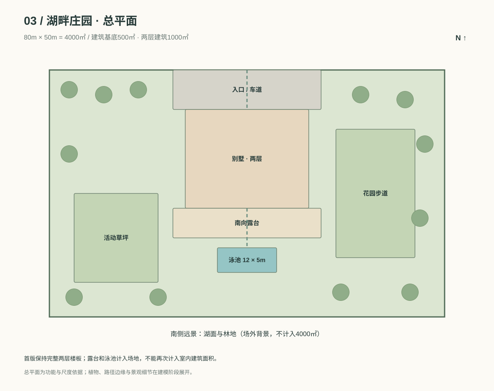
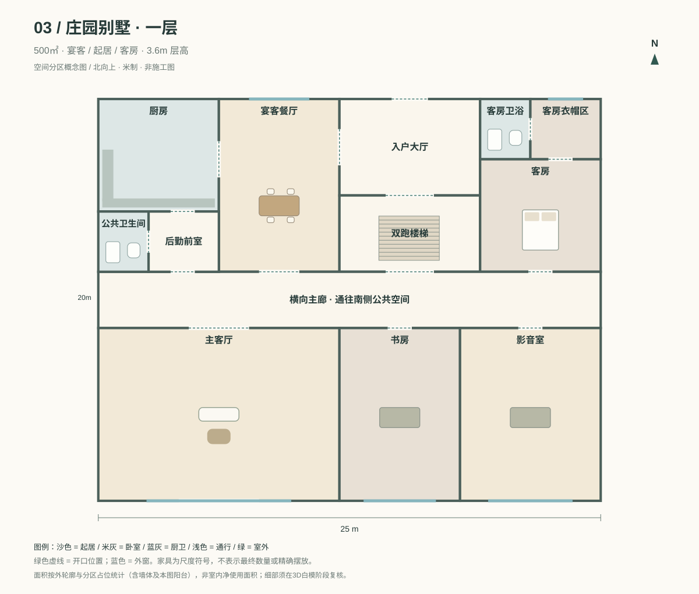
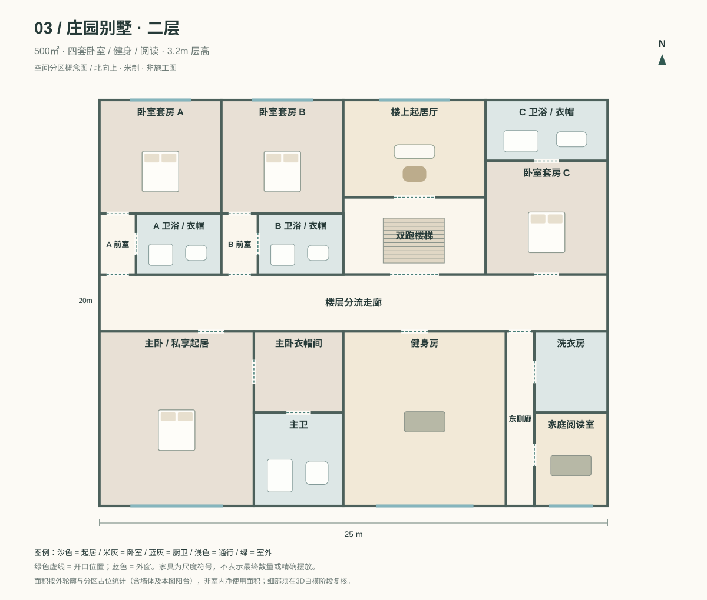

# 3D 装修家：场景设计与开发总计划

版本：1.0 · 2026-09-09  
状态：场景概念设计与平面审查完成；尚未开发3D网站，也未执行头显实测。

本文件整合已确认的产品计划与本轮场景设计，作为后续开发依据。当前交付是设计包，不是可运行的3D游戏。先开发三个场景，再实现完整装修、VR家具操作和自定义模型闭环。

## 1. 已确认的产品范围

- 电脑优先、写实风格、中文界面、单人自由装修沙盒，全部家具直接开放。
- 100㎡三室两厅、200㎡大平层、4000㎡庄园三个场景；庄园总占地4000㎡，其中两层别墅建筑合计1000㎡。
- 三种风格：奶油风、小清新、奢华风；三个等级：基础、精品、典藏。风格与等级独立，等级不代表清晰度或付费权限。
- 允许有限户型改造：非承重隔断和门洞；外墙、承重结构、楼板、楼梯及外窗固定。
- 免登录、本机自动存档、可导入导出作品文件。首版不做云同步、多人联机、金币和支付。
- VR面向Meta Quest 3／3S与双手柄，支持漫游和家具布置；隔断、门洞和文件导入在非沉浸界面操作。
- 用户可自行导入自包含GLB模型，保存在当前浏览器，不上传服务器。
- 免费可商用资产优先，不进行未经确认的付费素材采购。手机先支持查看和简化漫游。

## 2. 设计依据与面积口径

交付包含三张AI视觉概念图、四张楼层平面图、一张庄园总平面图，以及可读取的场景JSON。

**发生冲突时的采用顺序：本文件的修正约束 → scene-design.json与平面图的空间布局 → 概念图的风格与材质。** 概念图不能用于测量尺寸、计算面积或推断承重结构。

100㎡和200㎡按游戏外轮廓占位统计，包含墙体与图中阳台；不是房屋销售面积、套内使用面积或施工计算。平面图区域面积包含墙体占位，建模时从相邻区域扣除墙厚，不另加到外轮廓之外。4000㎡是场地面积，别墅基底500㎡、两层合计1000㎡；庭院、露台与泳池不计入1000㎡。

平面坐标原点在各层外轮廓西北角，x向东、图上y向南，单位米。转换到3D时采用x向东、y向上、z向南。别墅建筑原点位于场地(27.5, 8)，泳池位于(34, 36)，尺寸12×5m。

| 项目 | 100㎡小家 | 200㎡大平层 | 庄园别墅 |
|---|---|---|---|
| 外轮廓 | 10×10m | 20×10m | 每层25×20m |
| 层数 | 1 | 1 | 2 |
| 完成面层高目标 | 2.8m | 3.0m | 一层3.6m、二层3.2m |
| 主要过道分区宽 | 1.2m | 1.2m | 主廊2.8m，东侧廊1.4m |
| 默认日景 | 柔和城市日光 | 林地自然日光 | 午后湖畔暖光 |
| 首套风格 | 奶油风 | 小清新 | 奢华风 |

室内普通隔断厚度默认0.14m，外墙0.24m；具体墙段类型由建模数据标识。主要通道净宽目标：公寓≥1.0m、庄园≥1.2m。普通通行门洞建议1.05m，最终净通行目标≥0.9m；储物柜门不算人员通行门。楼梯两层位置严格对齐，白模阶段确定踏步与净空。此处均为游戏交互尺度，不代表施工规范认证。

## 3. 场景A：100㎡「奶油日光小家」

### 空间与动线

西侧中部入户，进入横向过道。北侧从西向东依次为次卧、书房兼客卧、主卧；南侧为卫生间、厨房、餐厅、客厅与阳台。客餐厅之间采用开放连接，卫生间从公共过道进入，厨房从餐厅进入，避免卫生间开门正对餐桌。

主卧靠北及东侧外窗；不再沿用早期草案中的“主卧朝南”，以本轮实际平面为准。书房兼客卧配置真实可睡眠床具，确保为三室，而不是把走廊或餐厅算作第三室。

| 空间 | 分区尺寸 | 占位面积 |
|---|---|---:|
| 次卧 | 3.3×4m | 13.20㎡ |
| 书房兼客卧 | 3.3×4m | 13.20㎡ |
| 主卧 | 3.4×4m | 13.60㎡ |
| 玄关及过道 | 10×1.2m | 12.00㎡ |
| 卫生间 | 2.5×2.2m | 5.50㎡ |
| 厨房 | 2.5×2.6m | 6.50㎡ |
| 餐厅 | 2.6×4.8m | 12.48㎡ |
| 客厅 | 4.9×4m | 19.60㎡ |
| 阳台 | 4.9×0.8m | 3.92㎡ |
| 合计 | 含墙体占位 | 100.00㎡ |

阳台较浅，定位为采光与站立观景阳台，首套样板间不放休闲桌椅。概念图中的阳台家具不作为建模要求。

### 视觉与陈设

- 色彩：暖白#EEE7D9、浅橡木#BC976F、亚麻#D4C4AD、低饱和绿#737C59；避免整体偏黄。
- 材质：细颗粒墙漆、哑光橡木地板、亚麻织物、圆角木家具、轻薄纱帘。
- 主要家具：2.4×0.95m直排沙发，0.85m直径茶几，1.2×0.75m四人餐桌，1.8×2m主床，1.5×2m次卧床，1.2×2m客卧床及紧凑书桌。
- 初始陈设约30件可编辑物件；厨房与卫生间成套设备另计为功能模块。
- 客厅南向采光，保持墙角和沙发底部接触阴影；夜景采用约3000K暖光。

**概念图审查结论：**材质与温馨氛围可采用；图中转角沙发明显比紧凑户型目标更宽。建模必须改用上述2.4m直排沙发，不能照图扩大客厅。餐椅退出与沙发前方通行需在白模阶段验证。

### 预设观察位置

入户看向客餐厅、客厅看向餐厅、主卧入口看床与衣柜、整层俯视。第一人称初始点位于玄关内，不能生成在门洞或墙内。VR传送点覆盖客厅、卧室和安全通道，浅阳台只在净空间足够时开放。

## 4. 场景B：200㎡「林景大平层」

### 空间与动线

西侧中部进入公共走廊。北侧布置两间次卧、书房兼客卧、公共卫浴与主卧套区；南侧为厨房、六人餐厅、客厅和连续景观阳台。以三段家具组建立尺度层次，避免客厅成为空旷大厅。

公共卫生间通过独立干区前室进入，洗衣柜开向前室，进入卫生间无需穿过洗衣房。主卫通过主卧衣帽区进入。四个卧室均有外窗，公共卫浴使用设备排风，不在没有外墙的位置伪造外窗。

| 功能组 | 占位面积 |
|---|---:|
| 次卧A、次卧B、书房兼客卧 | 47.04㎡ |
| 主卧、衣帽区、主卫 | 25.20㎡ |
| 公共卫生间、前室、洗衣柜 | 11.76㎡ |
| 横向走廊与玄关 | 24.00㎡ |
| 厨房与岛台 | 19.32㎡ |
| 餐厅 | 22.08㎡ |
| 客厅与阅读角 | 37.40㎡ |
| 景观阳台 | 13.20㎡ |
| 合计 | 200.00㎡ |

### 视觉与陈设

- 色彩：白垩#F3F1E8、原木#BE9E76、鼠尾草绿#83907D、炭灰#3F4942。
- 材质：直纹木地板、亚麻、藤编、浅色石材；绿色主要用于织物，可少量用于柜面。
- 主要家具：3.2m组合沙发、1.8×0.9m六人餐桌、2.0×0.9m岛台、藤编阅读椅、低柜与长书柜。
- 初始陈设约45件可编辑物件。阳台净深受限，使用靠边长凳和窄花槽，不沿整条阳台摆两排座椅。
- 日景保持林地反射的自然色，夜间公共区约3000K、工作区约3500K。

**概念图审查结论：**自然材质、林景和开放生活区层次可采用；厨房在画面右侧的位置仅用于表达视觉关系，不能替代平面图南西侧的厨房位置。建模中的岛台两侧保留约1.05m以上净通道，椅子拉出后仍需验证可达性。

### 预设观察位置

玄关看公共区、客厅看餐厨、阅读角看阳台、主卧入口、整层俯视。餐厨与客厅之间至少保留一条不穿过沙发座位区的主要路径。

## 5. 场景C：4000㎡「湖畔奢华庄园」

### 总平面与建筑体量

80×50m矩形地块，北侧入口车道通往别墅大厅；建筑居中偏北，25×20m，两层均保留完整建筑体量。南侧为露台、12×5m泳池，西侧为活动草坪，东侧为花园步道。湖面与远山属于场外环境，不计入4000㎡。

首版不设独立附属建筑，也不增加第三层。初版完成面净高按3.6m／3.2m设计，楼层标高还需计入楼板厚度。图像中的上层露台凹进不能用于减少室内面积；建模保留25×20m封闭外轮廓，通过外遮阳、窗框深度和材质变化形成层次。

### 一层：接待与活动

- 北侧：厨房、宴客餐厅、入户大厅、双跑楼梯、带衣帽及卫浴的客房。
- 中部：2.8m宽横向主廊，串联各功能区。
- 南侧：主客厅、书房、影音室；客厅与露台相连。
- 厨房与公卫之间设置干区后勤前室，进入厨房不需要穿过卫生间。
- 客房从主廊独立进入，衣帽区连接客房卫浴。

### 二层：家庭与私密生活

- 北侧：两间套房、楼上起居厅、楼梯和第三间套房。
- 南侧：主卧及衣帽卫浴、健身房、洗衣房与家庭阅读室。
- 两个北侧套房入口增加干区前室，避免通过卫浴进入卧室。
- 东侧增设1.4m分区宽的通道，洗衣房、阅读室独立可达，不互相借道。
- 一、二层楼梯占位均为x=12、y=4.8、7×3.8m，必须对齐。双跑楼梯的实际踏步净宽建议1.2m，每跑周边保留平台；净空、扶手、踏步数与标高在白模阶段校核。

别墅共五间卧室套房：一层客房一间、二层主卧与三间次卧。每层占位500㎡，两层合计1000㎡，房间矩形与开口位置详见scene-design.json。

### 视觉与陈设

- 色彩：浅石灰#D8CEBD、深木#514134、香槟金#A48B62、湖蓝#718F91。
- 材质：大尺度哑光石材、深木饰面、皮革、少量拉丝金属，避免镜面和金色占满空间。
- 主要家具：4.2m模块沙发组、3.2×1.1m十人餐桌、2×2.2m主床、影音座椅、健身器材、户外休闲家具。
- 初始可编辑陈设约100件，按楼层与房间分批加载；植被使用重复实例，不把每片叶子作为编辑对象。
- 夜景区分入口、花园、泳池、室内灯光，不让所有灯都投射实时阴影。初版泳池使用可反射的简化水面，不做复杂流体。

**概念图审查结论：**两层体量、石材深木搭配和庭院氛围可采用。泳池画面比例偏大、上层内退、远景方向和地块边界均不具备测量意义。开发严格按总平面：12×5m泳池、25×20m建筑、两层1000㎡；南侧湖景方向以图纸为准。

### 预设观察位置

北侧入口、客厅看泳池、二层主卧入口、泳池南侧看建筑、庄园鸟瞰。VR通过传送点与楼层菜单移动；泳池水面、屋顶、花坛和未加载区域禁止传送。近距离真实行走不能被程序强行移动头部，接近障碍时使用渐隐或安全位置恢复提示。

## 6. 场景审查记录

本轮实际检查了三张概念图、五张平面图的设计内容，以及机器可读布局。脚本验证不是建筑审图，也不是3D碰撞实测。

| 编号 | 发现 | 本轮处理 | 状态 |
|---|---|---|---|
| D01 | 小家卫生间入口可能朝向餐桌 | 调换南西侧厨卫分区，卫生间直接接公共走廊 | 平面已修正 |
| D02 | 大平层公共卫浴可能需穿洗衣区 | 增加独立干区前室，洗衣改柜体 | 平面已修正 |
| D03 | 别墅一层厨房借道厨卫服务区 | 拆分公卫与后勤前室 | 平面已修正 |
| D04 | 二层套房A/B可能经卫浴进入卧室 | 增加干区前室，卧室和卫浴分别开门 | 平面已修正 |
| D05 | 二层阅读室借道洗衣房 | 增加东侧独立走廊 | 平面已修正 |
| D06 | 效果图沙发过大、泳池及立面比例不可靠 | 固定实际模型尺寸与完整二层外轮廓；效果图只作风格参考 | 已写入建模约束 |
| D07 | 小家及大平层阳台较浅 | 小家不放座椅，大平层只放靠边窄家具 | 已写入建模约束 |
| D08 | AI画面无法证明实际VR舒适性和游戏帧率 | 明确白模、碰撞、实机性能验收环节 | 待开发实测 |

已执行的布局检查：四个楼层分区总面积分别为100、200、500、500㎡；区域不重叠、无越界；每个区域通过开口连接入口或楼梯；开口落在相邻空间共同边界内；别墅上下层楼梯占位一致。结果见design-checks.json。

尚未验证：门扇扫掠、家具碰撞、楼梯净空、照明实际渲染、实时帧率、头显输入、模型导入和存档恢复。不能将这些项目标记为完成。

## 7. 统一家具、材质与环境能力

最终首版内置54款核心家具：奶油／小清新／奢华 × 基础／精品／典藏 × 沙发／桌／椅／床／柜／灯。另提供18款配套物件，覆盖挂画、地毯、绿植、桌面饰品、窗帘、厨卫与户外类别。同一模型只换色不能计作不同核心家具。

家具按房间、类别、风格、等级筛选，显示尺寸。三种住宅都允许自由混搭；本轮每套场景的一种风格是首套默认陈设，后续每种住宅均补齐三个可编辑风格样板间及空房入口。

墙面提供墙漆、壁纸、木饰面、石材；地面提供木地板、瓷砖、石材。环境提供城市、林地、海景，和白天、黄昏、夜晚。环境切换只改变远景及光照，不修改房屋布局。灯光支持开关、亮度与色温。

## 8. 装修与VR操作

### 电脑端

中央3D场景、左侧素材库、右侧属性面板，顶部提供视角、楼层、撤销、存档与截图。支持俯视、环绕、第一人称，编辑时隐藏遮挡墙体和上层楼板，漫游时恢复。

家具支持拖放、移动、旋转、复制、删除、多选与组合移动。提供位置和角度输入；网格、贴墙与角度吸附可关闭。标准家具保持真实尺寸，装饰物和地毯可有限等比缩放。

落地、挂墙、吸顶、桌面四类放置规则分开。使用简化实体碰撞体和承载面，允许椅子入桌、地毯位于家具下方；不能仅以大包围盒拒绝这些合理重叠。明显穿墙或实体冲突显示红色预览，禁止提交。初版不模拟家具掉落、弹跳等动态物理。

至少50步撤销与重做，一次连续拖动为一步；所有场景编辑经过统一命令层。删除承载挂件的墙段需列出连带变化并支持整体撤销。改造外轮廓、承重结构、楼板、外窗和楼梯不在首版范围。

### Quest VR

通过用户主动操作进入WebXR，采用双手柄射线及浮动面板。默认地面传送、30°分段转向，支持站立及坐姿，楼层菜单用于快速切层。支持新增、移动、旋转、复制、删除家具，切换可用材质、撤销及重做。隔断和门洞编辑在非沉浸界面操作。

VR与电脑共享场景与命令；退出、失焦、手柄断连时取消未提交拖动，保留已提交操作。不支持沉浸模式或权限拒绝时仍可使用普通3D。

部署使用HTTPS，通过能力检测确认WebXR可用，不以浏览器名称猜测支持情况。技术参考：[Babylon WebXR](https://github.com/BabylonJS/Documentation/blob/master/content/features/featuresDeepDive/webXR/introToWebXR.md)、[WebXR接入条件](https://developer.mozilla.org/en-US/docs/Web/API/WebXR_Device_API)。

## 9. GLB导入与本机作品包

导入流程：选择自包含.glb → 校验预览 → 输入名称与实际尺寸、修正朝向 → 设置放置类型和必要承载面 → 加入“我的模型”。用户模型作为静态家具使用，忽略自带灯光、摄像机与动画行为。

首版限制：每个文件≤50MB、≤20万三角面、单张纹理≤4096×4096。校验文件内容与解码资源预算，不仅检查后缀；不允许模型加载任意外部资源，拒绝不支持的必要扩展。超限说明原因，不静默删减模型。

IndexedDB保存多个作品、资产Blob与缩略图。每次编辑提交约3秒后自动保存，另有手动保存及PNG截图。必须显示保存状态和“此浏览器本机保存”提示。

作品导出为.home.zip，包含版本清单、家具位置、材质、隔断、环境、自定义GLB及校验信息。内置资源通过固定版本标识引用，不重复打包；用户模型按内容去重。导入完整校验后再提交，不覆盖有效旧存档。删除被作品引用的模型时阻止删除并列出引用作品。

电脑与头显通过手动转移作品文件后导入；头显修改后可反向导出。首次导入头显在非沉浸文件选择界面完成，不承诺自动同步。ZIP解压需限制总大小、条目数及解压比例；损坏或过重作品必须在导入前给出明确错误。

## 10. 工程结构与性能目标

使用Sites工程、React、TypeScript、Babylon.js，以WebGL 2作为初版渲染基线。场景几何、资产、编辑命令、输入适配、存档各自分层；React组件不作为场景数据唯一来源。

| 类型 | 内容 |
|---|---|
| SceneDefinition | 住宅、楼层、固定结构、可编辑墙段、环境、初始布局及区域加载信息 |
| AssetDefinition | 资产来源、模型、尺寸、风格、等级、材质槽、碰撞体、承载面 |
| DesignSave | 版本、场景引用、家具实例、隔断改动、材质及环境 |
| ProjectArchive | 导出清单、资源校验、自定义模型及版本 |

scene-design.json是本轮空间设计输入，后续通过适配转换为运行时SceneDefinition；不能直接把每个房间矩形都建成四面实体墙，否则公共开口和相邻墙体会重复。先合并共享边界，再按doors切开口。stairs类型须替换为实际楼梯与对应楼板开口。

固定外壳、可改造墙体、家具、灯光与室外实例分组。厨房、卫浴模块明确承载点与碰撞体；自定义模型不能自动成为房屋承重或房间结构。

桌面基准：M1／16GB、1920×1080、中画质，公寓150件家具、庄园总500件家具，代表路线平均≥30 FPS。Quest 3和3S分别实机测试，默认72Hz、VR画质、当前区域约50件标准家具，10分钟代表性漫游与编辑，目标95%以上帧满足刷新预算；加载切换独立记录。

采用分区与楼层加载、LOD、不可见对象剔除、重复模型实例化、纹理压缩。Quest纹理优先KTX2／Basis，限制动态阴影和后处理；静态外壳可预计算环境信息，移动家具和新隔断阴影不能完全依赖固定烘焙图。参见[Meta WebXR性能指南](https://developers.meta.com/horizon/documentation/web/webxr-perf-bp/)。

原始用户模型保留；为VR生成受限纹理副本。过重作品在进入VR前列出问题，提供可撤销的简化代理预览，不改写原件。任意自定义模型、无限家具数量不承诺固定帧率。

## 11. 后续开发里程碑

### M1：三个可漫游场景

按本轮JSON和平面先建立三个白模；校核面积、墙体、门洞、楼板、楼梯、所有房间可达性及标准家具尺寸。以100㎡客厅建立材质样板，再完成200㎡与庄园精装。三个场景提供选择、空房切换、俯视／环绕／第一人称、昼夜预设、Quest参观。截图审查后修复阻断和明显视觉缺陷。

这一阶段先实现代表性陈设，不要求72款资产全量到位；但三个场景不能只是图片背景或不能进入的外壳。

### M2：完整装修闭环

实现编辑命令、放置规则、碰撞、吸附、材质、非承重隔断及门洞、撤销、本机多作品存档。先在100㎡跑通，再复用到另两个场景。

### M3：VR编辑与用户模型

实现手柄家具库、选择及变换、GLB导入与校验、VR资源处理、作品包跨设备往返。不以模拟器替代Quest实机验收。

### M4：内容补齐、验证与发布

补齐72款家具、三场景各三种风格样板间、三套背景与时段。执行兼容性、存档恢复、异常输入、资源加载失败及性能测试，修复后发布HTTPS网站。

## 12. 最终验收清单

- 三个住宅真实可进入，家具与空间比例符合本轮设计；每个房间可达，楼梯连通正确。
- 房间面积与楼层口径一致；庄园场地、建筑面积、泳池不能混算。
- 摆放、吸附、合法重叠、非法穿插、挂件依附、隔断修改及撤销正确。
- 重开页面、导出再导入后，用户家具、位置、材质、环境和结构一致。
- GLB损坏、过重、外部依赖、错误尺寸和存储不足有明确处理，不损坏旧作品。
- Quest进入、退出、传送、转向、楼层切换、家具编辑、断连恢复均通过实机验证。
- 白天、黄昏、夜晚无严重漏光、穿模、悬浮或贴图缺失；性能达到约定基准。
- 桌面Chrome、Edge、Safari完成核心流程；手机简化体验明确区分能力。
- 无实机证据的VR项目保持“待实机验证”，不得写成已完成。

## 13. 文件索引与素材记录

- design-review.html：视觉设计审阅页，可离线打开。
- development-plan.md：本总计划。
- scene-design.json：房间占位、门洞及场地坐标。
- design-checks.json：已执行的面积、相邻开口、连通性与楼梯对齐检查。
- assets/：三张原始概念图与各自精确生成提示词；使用内置ImageGen生成。
- plans/：四张楼层平面图与一张总平面SVG，可无损缩放。

概念图是视觉方向，不是模型来源。后续可商用3D资源逐项登记许可证与来源，例如[Poly Haven许可](https://polyhaven.com/license)；本轮未购买素材、未上传用户文件、未创建或发布游戏网站。
